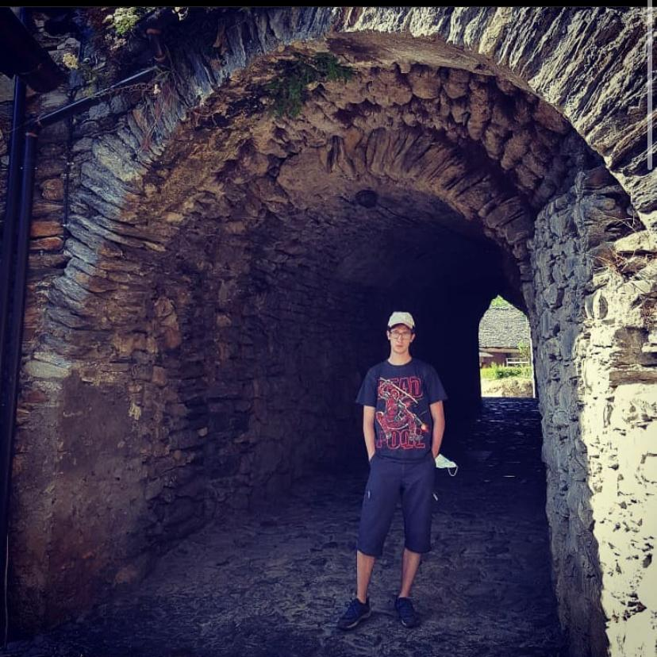

# Falcas Engine
this engine is made by [Bernat Casañas](https://github.com/BernatCasanas) and [Arnau Falgueras](https://github.com/Arnau77), students of CITM, UPC of Terrassa in the subject of video game engines taught by [Marc Garrigó](https://github.com/markitus18). The aim of this game engine was to create a good base to later advance in UI. Only for educational propouses.

## Bernat Casañas

### Things Done

* Importer
* Models
* General Editor
* Save/Load
* Serialized files
* Game Manager
* Font and Image

## Arnau Falgueras

### Things Done

* Controls
* Hierarchy and Inspector
* Resource Manager
* Explorer
* AABB
* Camera
* UI Module and system
* CheckBox, Input Box and Button

## Core Sub-Systems

* Models & Textures: You can drop models and textures creating all the meshes, materials and components.
* Scenes: You can create, save and load scenes in order to navegate thought them.
* Resource Manager: All files are conected with a meta and its "falcasfile" in Library folder

# UI System

The UI system is built by a general module that controls all processes and general variables. It then consists of four components: Input box, Check Box, Image and Button. Each of them has its variables that form it. The interesting thing is that the text is in the general component so that all the children can use it. The elements of the UI can be dragged and moved around the scene. Each component has a transform2d that is linked to the component in question. 
* Image: It is composed by a material that is printed in each frame.
* Input Box: It's composed by a text that when you click it changes to the one you will write. There is also a detail bar to know where you write.
* Check Box: There are 4 materials that change according to how you interact with them. Hover and Clicked depending on whether the tick is activated or not.
* Button: It's composed of 3 materials. Hover, click and unclicked. Besides, there is a text above.

 

* [Github Engine](https://github.com/Falcas-Games/Falcas-Engine/tree/master)
* [release](Last Release)

 

## License

MIT License

Copyright (c) 2020 Falcas-Games

Permission is hereby granted, free of charge, to any person obtaining a copy of this software and associated documentation files (the "Software"), to deal in the Software without restriction, including without limitation the rights to use, copy, modify, merge, publish, distribute, sublicense, and/or sell copies of the Software, and to permit persons to whom the Software is furnished to do so, subject to the following conditions:

The above copyright notice and this permission notice shall be included in all copies or substantial portions of the Software.

THE SOFTWARE IS PROVIDED "AS IS", WITHOUT WARRANTY OF ANY KIND, EXPRESS OR IMPLIED, INCLUDING BUT NOT LIMITED TO THE WARRANTIES OF MERCHANTABILITY, FITNESS FOR A PARTICULAR PURPOSE AND NONINFRINGEMENT. IN NO EVENT SHALL THE AUTHORS OR COPYRIGHT HOLDERS BE LIABLE FOR ANY CLAIM, DAMAGES OR OTHER LIABILITY, WHETHER IN AN ACTION OF CONTRACT, TORT OR OTHERWISE, ARISING FROM, OUT OF OR IN CONNECTION WITH THE SOFTWARE OR THE USE OR OTHER DEALINGS IN THE SOFTWARE.
